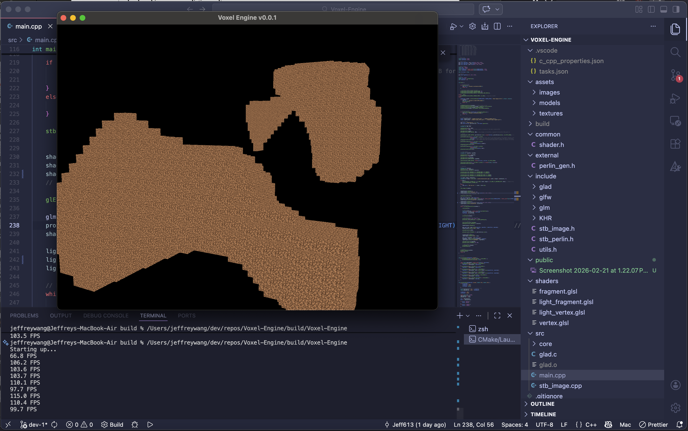
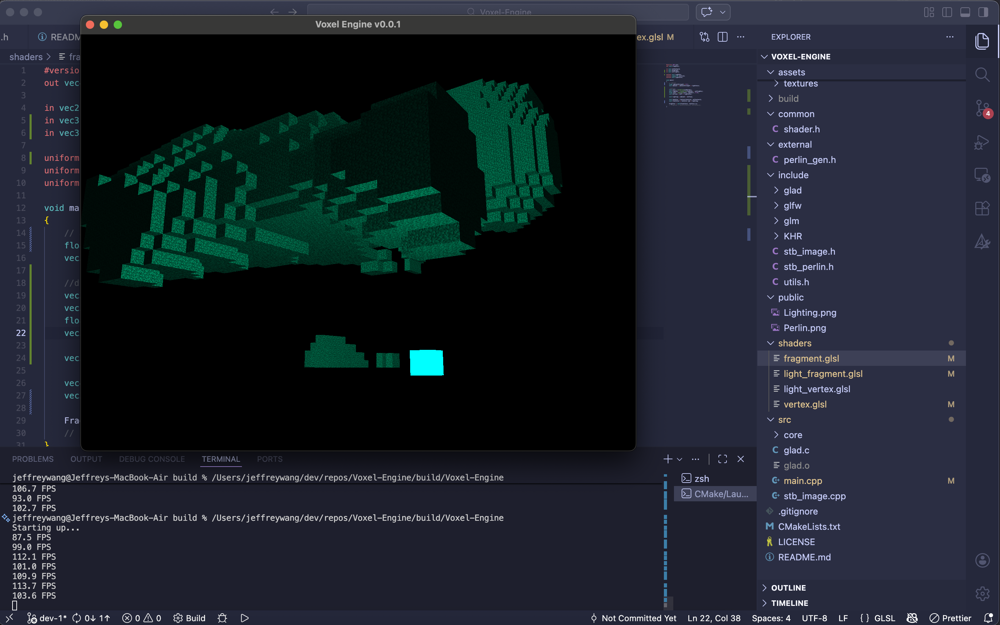
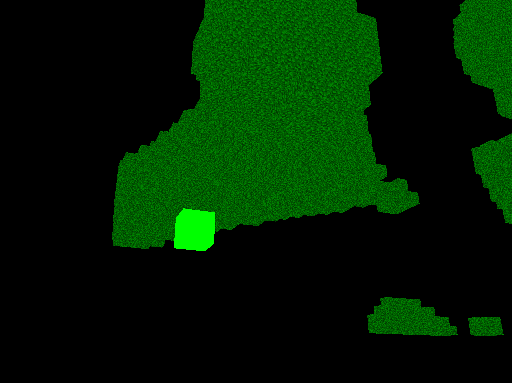

# Voxel-Engine

This is a project I have been using to learn more about OpenGL and C++ as well as graphics programming.

## Features
- Perlin noise terrain generation.

- Lighting effects (Diffuse and Ambient).


## Dependencies

### Linux

- Install CMake.
### Ubuntu
```
sudo apt install cmake
```

- Install a C/C++ compiler.
### Ubuntu
```
sudo apt install gcc
```

- Install GLFW linux dependencies.
#### Ubuntu/Mint
```
sudo apt install libwayland-dev libxkbcommon-dev xorg-dev
```
- No GLFW dependencies needed for windows.

## Installation

```
cd build
cmake ..
cmake --build
```
